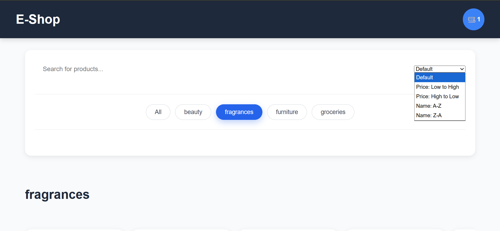
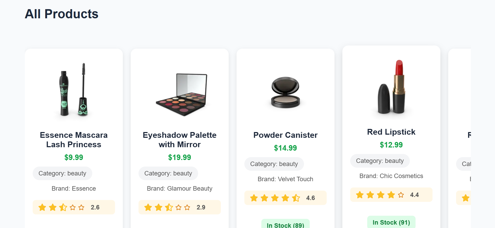
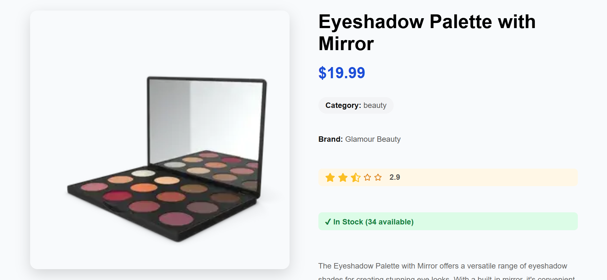
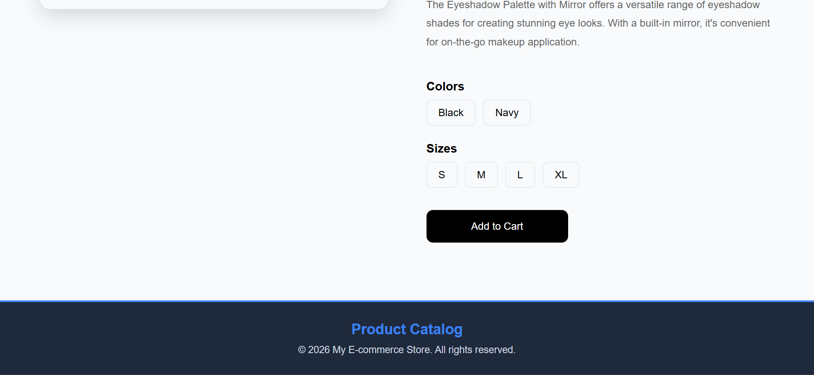
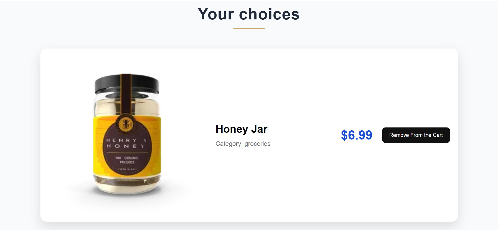
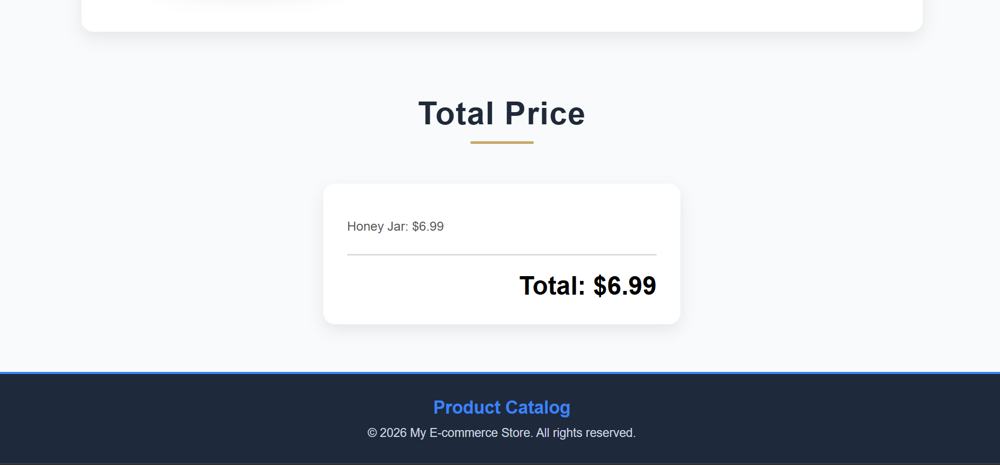
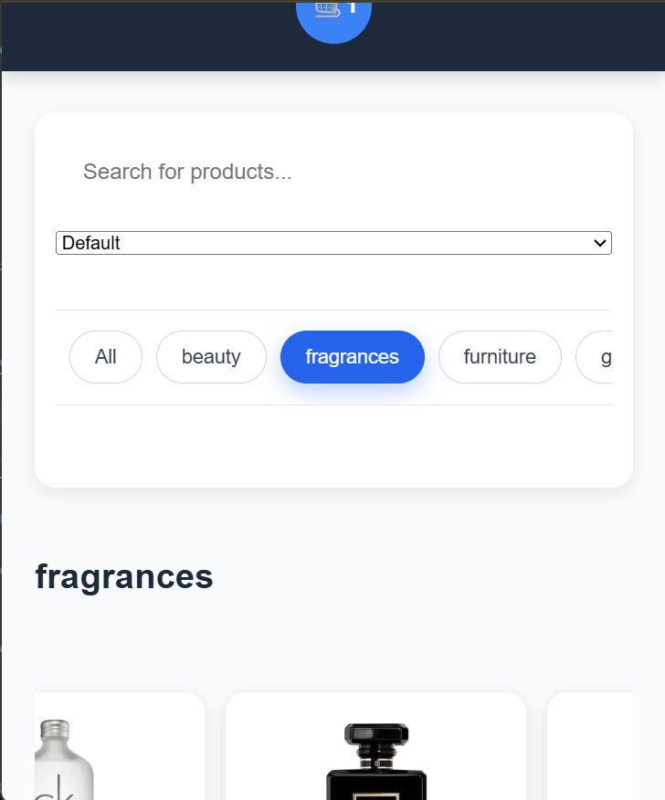

# E-Shop


A modern e-commerce website built with Next.js, React, and TypeScript.

## Table of Contents

- [About the Project](#about-the-project)
- [Features](#features)
- [Tech Stack](#tech-stack)
- [Screenshots](#screenshots)
- [How to Use](#how-to-use)
- [Project Structure](#project-structure)
- [What I Learned](#what-i-learned)
- [Challenges](#challenges)
- [Future Improvements](#future-improvements)
- [Live Demo](#live-demo)
- [Author](#author)
- [Acknowledgements](#acknowledgements)

## About the Project

E-Shop is a modern e-commerce application built with Next.js, React, and TypeScript. It allows users to browse products, search by keyword, filter by category, view product details, and manage a shopping cart with data persisted using Local Storage.

## Features

- Browse products
- Search products
- Filter by category
- Sort products
- Dynamic product details page
- Shopping cart
- Cart persistence using Local Storage
- Responsive design

## Tech Stack

### Frontend
- Next.js
- React
- TypeScript
- CSS

### State Management
- React Context

### Storage
- Local Storage

### API
- DummyJSON

## Screenshots

### Home Page

<p align="center">
  
  
</p>

### Product Details

<p align="center">
  
  
</p>

### Shopping Cart

<p align="center">
  
  
</p>

### Responsive Design

<p align="center">
  
</p>

## How to Use

1. Browse all available products.
2. Search products by name.
3. Filter products by category.
4. Open a product to view its details.
5. Add products to the shopping cart.
6. Your cart is automatically saved using Local Storage.

## Project Structure

```text
.
├── app/
│   ├── cart/
│   │   └── page.tsx
│   ├── components/
│   │   ├── AddToCartButton.tsx
│   │   ├── CategoryMenu.tsx
│   │   ├── Footer.tsx
│   │   ├── Header.tsx
│   │   ├── ProductCard.tsx
│   │   ├── ProductSection.tsx
│   │   ├── RemoveFromCartButton.tsx
│   │   ├── SearchBar.tsx
│   │   └── SortSelect.tsx
│   ├── context/
│   │   └── CartContext.tsx
│   ├── products/
│   │   └── [id]/
│   │       └── page.tsx
│   ├── types/
│   │   └── product.ts
│   ├── globals.css
│   ├── layout.tsx
│   └── page.tsx
│
├── lib/
│   └── api.ts
├── public/
├── screenshots/
└── README.md
```

## What I Learned

- Building applications with Next.js App Router
- Managing global state with React Context
- Persisting data using Local Storage
- Creating dynamic routes
- Building reusable React components
- Creating responsive layouts with CSS
- Implementing search and category filtering
- Managing application state with React Hooks
- Debugging and solving application issues

## Challenges

During development I learned how to:

- Manage shared state across multiple pages.
- Keep the shopping cart synchronized with Local Storage.
- Create reusable UI components.
- Build responsive layouts for different screen sizes.

## Future Improvements

- User authentication (Sign up & Login)
- Wishlist
- User profile
- Checkout page
- Online payment integration
- Product reviews and ratings
- Multi-language support
- Admin dashboard

## Live Demo

🚀 https://e-shop-one-flax.vercel.app/

## Author

Haroun Draoui

- GitHub: https://github.com/Draoui-Haroun
- LinkedIn: https://www.linkedin.com/in/draoui-haroun-1b0200413/

## Acknowledgements

- Product data provided by DummyJSON API.
- Thanks to the Next.js documentation for development guidance.
